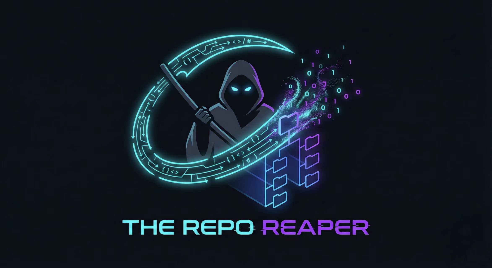
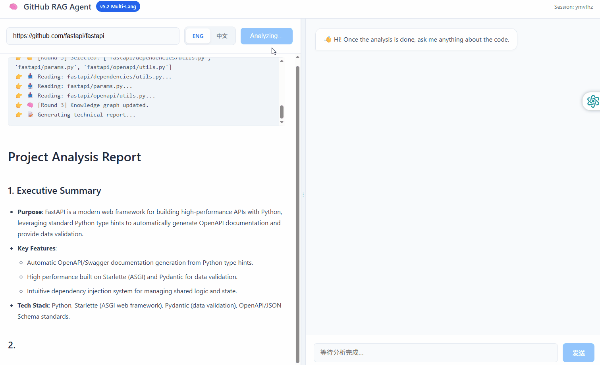

<div align="center">

  

  <h1>RepoReaper</h1>

  <h3>💀 Harvest Logic. Dissect Architecture. Chat with Code.</h3>

  <p>
    <a href="./README.md">English</a> • 
    <a href="./README_zh.md">简体中文</a>
  </p>

  <a href="./LICENSE">
    
  </a>
  
  
  

  <br>

  
  
  
  
  

  <br>
  <br>

  <p>
    <b>👇 Live Demo / 在线体验 👇</b>
  </p>
  <p align="center">
    <a href="https://realdexter-reporeaper.hf.space" target="_blank" rel="noopener noreferrer">
      
    </a>
    &nbsp;&nbsp;&nbsp;
    <a href="https://realdexter.com/" target="_blank" rel="noopener noreferrer">
      
    </a>
  </p>

  <p align="center">
    <small>
      ⚠️ Public demos use shared API quotas. Deploy locally for the best experience.
    </small>
  </p>

  <br>

  

  <br>
</div>

---

An autonomous Agent that dissects any GitHub repository. It maps code architecture, warms up semantic cache, and answers questions with Just-In-Time context retrieval.

---

## ✨ Key Features

| Feature | Description |
|:--------|:------------|
| **Multi-Language AST Parsing** | Python AST + Regex patterns for Java, TypeScript, Go, Rust, etc. |
| **Hybrid Search** | Qdrant vectors + BM25 with RRF fusion |
| **JIT Context Loading** | Auto-fetches missing files during Q&A |
| **Query Rewrite** | Translates natural language to code keywords |
| **End-to-End Tracing** | Langfuse integration for observability |
| **Auto Evaluation** | LLM-as-Judge scoring pipeline |

---

## 🏗 Architecture

```
┌─────────────────────────────────────────────────────────────┐
│  Vue 3 Frontend (SSE Streaming + Mermaid Diagrams)          │
└─────────────────────┬───────────────────────────────────────┘
                      │
┌─────────────────────▼───────────────────────────────────────┐
│  FastAPI Backend                                            │
│  ┌─────────────┐ ┌─────────────┐ ┌─────────────────────┐   │
│  │ Agent       │ │ Chat        │ │ Evaluation          │   │
│  │ Service     │ │ Service     │ │ Framework           │   │
│  └──────┬──────┘ └──────┬──────┘ └─────────────────────┘   │
│         │               │                                   │
│  ┌──────▼───────────────▼──────┐  ┌─────────────────────┐  │
│  │ Vector Service (Qdrant+BM25)│  │ Tracing (Langfuse)  │  │
│  └─────────────────────────────┘  └─────────────────────┘  │
└─────────────────────────────────────────────────────────────┘
```

---

## 🛠 Tech Stack

**Backend:** Python 3.10+ · FastAPI · AsyncIO · Qdrant · BM25  
**Frontend:** Vue 3 · Pinia · Mermaid.js · SSE  
**LLM:** DeepSeek V3 · SiliconFlow BGE-M3  
**Ops:** Docker · Gunicorn · Langfuse

---

## 🏁 Quick Start

**Prerequisites:** Python 3.10+ · GitHub Token · LLM API Keys

```bash
# Clone & Setup
git clone https://github.com/tzzp1224/RepoReaper.git && cd RepoReaper
python -m venv venv && source venv/bin/activate
pip install -r requirements.txt

# Configure .env
cat > .env << EOF
GITHUB_TOKEN=ghp_xxx
DEEPSEEK_API_KEY=sk-xxx
SILICON_API_KEY=sk-xxx
EOF

# Run
python -m app.main
```

**Docker:**
```bash
docker build -t reporeaper . && docker run -d -p 8000:8000 --env-file .env reporeaper
```

Open `http://localhost:8000` and paste any GitHub repo URL.


## 📈 Star History

<a href="https://star-history.com/#tzzp1224/RepoReaper&Date">
 <picture>
   <source media="(prefers-color-scheme: dark)" srcset="https://api.star-history.com/svg?repos=tzzp1224/RepoReaper&type=Date&theme=dark" />
   <source media="(prefers-color-scheme: light)" srcset="https://api.star-history.com/svg?repos=tzzp1224/RepoReaper&type=Date" />
   
 </picture>
</a>