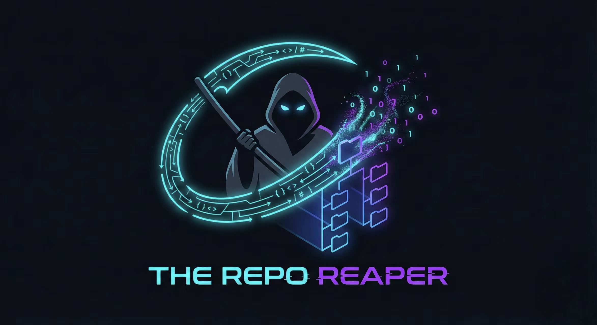

<div align="center">
  

  <h1>RepoReaper</h1>
  <p><b>Harvest Logic. Dissect Architecture. Chat with Code.</b></p>
  <p><b>NUS CS5260 Project (Spring 2026)</b></p>

  <p>
    <a href="./README.md">English</a> •
    <a href="./README_zh.md">简体中文</a>
  </p>

  <p>
    
    
    
    
    
  </p>

  <p>
    <a href="https://realdexter-reporeaper.hf.space" target="_blank" rel="noopener noreferrer">
      
    </a>
    <a href="https://repo.realdexter.com/" target="_blank" rel="noopener noreferrer">
      
    </a>
  </p>

  <video src="./docs/demo.mp4" width="800" style="max-width: 100%; border-radius: 8px;" controls loop muted playsinline>
    Your browser does not support the video tag.
  </video>
</div>

RepoReaper is an evidence-grounded repository intelligence agent for engineers, reviewers, and researchers who need to understand unfamiliar codebases quickly. It turns a GitHub repository into a reusable investigation workspace, so follow-up questions and verification stay anchored to the same context. Instead of a one-shot summary, you get a persistent workflow for analysis, chat, reproducibility checks, and paper-to-code validation.

## Why RepoReaper
- **Evidence-grounded by default**: answers and judgments are tied to retrievable repository evidence, not free-form summaries.
- **Reusable workspace, not one-shot output**: each repository maps to a persistent session with reusable context, reports, and artifacts.
- **Retrieval built for hard questions**: vector search + BM25 + RRF + query rewrite + JIT file loading recover missing evidence when first-pass context is thin.
- **Verification and inspectability built in**: Reproducibility Score, Paper Align, and white-box tracing make conclusions reviewable.

## What You Get
- A repository-scoped analysis workspace with reusable session state, indexed context, and generated artifacts.
- Repo chat for architecture exploration and implementation-level Q&A inside the same repository session.
- **Issues Notebook** and **Commit Roadmap** for two complementary views: community pressure and delivery direction.
- **Reproducibility Score** with structured risks, evidence references, and localized summary output.
- **Paper Align** outputs with claim-level verdicts: `aligned`, `partial`, `missing`, and `insufficient_evidence`.
- **Suggested Questions** with three anchored follow-ups: architecture, implementation, and reproduction path.
- Streaming output across analysis, insights, chat, and alignment so users can inspect progress before completion.

## Practical Use Cases
| Scenario | Outcome |
| :-- | :-- |
| Onboarding to a new repository | Analyze once, then reuse bilingual reports and indexed context for later deep dives. |
| Investigating implementation details | Chat rewrites the query, retrieves relevant chunks, and uses JIT file loading when first-pass evidence is insufficient. |
| Reviewing project trajectory | Issues Notebook and Commit Roadmap reveal maintenance pressure and delivery direction in parallel. |
| Preparing a reproducibility handoff | Reproducibility Score provides structured risks, evidence references, and localized summary output. |
| Verifying paper claims against code | Paper Align checks claims against code evidence and surfaces missing or partial support with stream diagnostics. |
| Planning next questions | Suggested Questions proposes three anchored follow-ups for architecture, implementation, and reproduction. |

## Key Features

- **📄 Paper-to-Code Alignment**: Upload a research paper (PDF) and automatically verify if the repository implementation matches the claims and algorithms described in the paper.
- **🎯 Reproducibility Scoring**: Automatically evaluates the repository's documentation, environment setup, and code structure to generate a comprehensive reproducibility score.
- **💬 Interactive Codebase Chat**: Ask specific questions about the codebase using a context-aware Retrieval-Augmented Generation (RAG) system based on Qdrant.
- **📊 Issue & Commit Insights**: Summarize repository activity, track feature evolution, and analyze issue resolutions.
- **🗺️ Architecture & Roadmap**: Automatically generate Mermaid.js diagrams for code architecture and development roadmaps.
- **🧠 Multi-LLM Support**: Seamlessly switch between OpenAI, Gemini, Anthropic (Claude), and DeepSeek models.
- **👁️ Observability & Tracing**: Built-in LLM tracing and evaluation observability to monitor token usage and prompt chains (supported via dedicated Docker Compose profiles).

## How RepoReaper Works
- **Session-centered state model**: each repository maps to a stable session, and analysis context, reports, and artifacts are reused across visits.
- **Layered retrieval pipeline**: vector search and BM25 are fused by RRF, then query rewrite and JIT file loading recover missing evidence for complex questions.
- **Streaming-first execution**: analysis, insights, chat, and alignment emit incremental output so users can inspect progress before full completion.
- **Explicit cache hierarchy**: issues/roadmap/questions artifacts and split reproducibility caches (`core` + localized) reduce repeat latency while preserving refresh control.
- **Concurrency-safe writes**: repository-level locks with `memory` / `file` / `redis` backends prevent conflicting writes on the same session.
- **Provider-pluggable inference layer**: model provider is configurable (`openai`, `deepseek`, `anthropic`, `gemini`) without changing workflow semantics.

## Observability and Quality Loop
- **Traceable request path**: tracing is attached to core chat sessions, so investigation steps remain inspectable instead of opaque.
- **Non-blocking evaluation**: auto-evaluation runs in async sidecar mode, separating answer latency from scoring latency.
- **Reviewable quality control**: suspicious evaluation samples enter a review queue with stable approve/reject actions.
- **Operational visibility**: runtime metrics and evaluation stats expose queue state, score distribution, and failure surfaces.
- **Fail-open behavior**: observability and evaluation failures do not block the primary analysis and chat workflow.

## Paper Align in Review Work
- **Claim extraction**: paper text is decomposed into verifiable technical claims.
- **Evidence retrieval per claim**: each claim is expanded into retrieval-friendly queries and matched against repository snippets.
- **Explicit judgment states**: outputs separate `aligned`, `partial`, `missing`, and `insufficient_evidence`, with evidence excerpts.
- **JIT fallback for hard claims**: when evidence is weak, candidate files are fetched/indexed on demand and judged again.
- **Streaming diagnostics**: claim progress, retrieval traces, fallback actions, and final confidence are emitted as inspectable events.

## Quick Start
### Local (fastest path)
Prerequisites: Python `3.10-3.12`, one LLM API key (required), `GITHUB_TOKEN` (recommended), embedding key (recommended for retrieval quality).

```bash
git clone https://github.com/tzzp1224/RepoReaper.git
cd RepoReaper

python3 -m venv .venv
source .venv/bin/activate
pip install -r requirements.txt

cp .env.example .env
# Required: LLM_PROVIDER + matching API key
# Supported providers: openai | deepseek | anthropic | gemini
# Recommended: GITHUB_TOKEN and SILICON_API_KEY
# Optional: LANGFUSE_ENABLED=true with Langfuse keys

python3 -m app.main
```

Open [http://localhost:8000](http://localhost:8000).

### Docker Compose (App + Qdrant)
```bash
cp .env.example .env
docker compose up -d --build
```

### Optional Observability Stack (Langfuse)
```bash
docker compose -f docker-compose.yml -f docker-compose.observability.yml up -d --build
```

Compatibility note:
- Recommended runtime: Python `3.10-3.12`.
- Python `3.14` currently has known caveats in this repo (Langfuse SDK compatibility and some legacy asyncio test patterns).

## Star History

<a href="https://star-history.com/#tzzp1224/RepoReaper&Date">
 <picture>
   <source media="(prefers-color-scheme: dark)" srcset="https://api.star-history.com/svg?repos=tzzp1224/RepoReaper&type=Date&theme=dark" />
   <source media="(prefers-color-scheme: light)" srcset="https://api.star-history.com/svg?repos=tzzp1224/RepoReaper&type=Date" />
   
 </picture>
</a>
