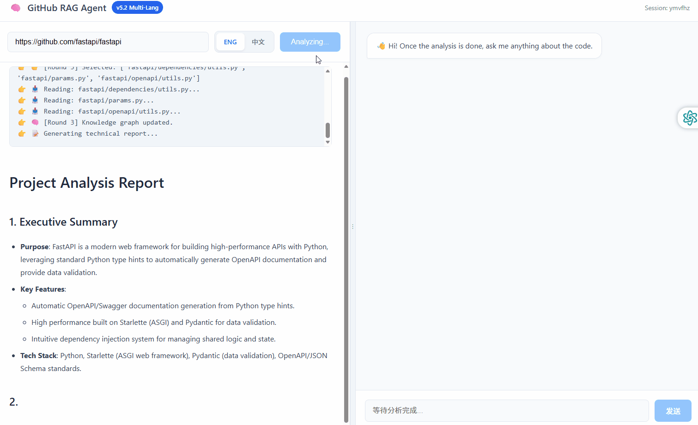

<div align="center">

  

  <h1>RepoReaper</h1>

  <h3>💀 Harvest Logic. Dissect Architecture. Chat with Code.</h3>

  <p>
    <a href="./README.md">English</a> • 
    <strong>简体中文</strong>
  </p>

  <a href="./LICENSE">
    
  </a>
  
  
  

  <br>

  
  
  
  
  

  <br>
  <br>

  <p>
    <b>👇 在线体验 👇</b>
  </p>
  <p align="center">
    <a href="https://realdexter-reporeaper.hf.space" target="_blank" rel="noopener noreferrer">
      
    </a>
    &nbsp;&nbsp;&nbsp;
    <a href="https://repo.realdexter.com/" target="_blank" rel="noopener noreferrer">
      
    </a>
  </p>

  <p align="center">
    <small>
      ⚠️ 中国用户请使用 Seoul Server。如遇限流，建议本地部署。
    </small>
  </p>

  <br>

  

  <br>
</div>

---

自治型代码审计 Agent：解析任意 GitHub 仓库架构，构建语义缓存，支持即时上下文检索问答。

---

## ✨ 核心特性

| 特性 | 说明 |
|:----|:----|
| **多语言 AST 解析** | Python AST + 正则适配 Java / TS / Go / Rust 等 |
| **混合检索** | Qdrant 向量 + BM25 关键词，RRF 融合排序 |
| **JIT 动态加载** | 问答时自动拉取缺失文件 |
| **查询重写** | 自然语言 → 代码检索关键词 |
| **端到端追踪** | Langfuse 集成，全链路可观测 |
| **自动评估** | LLM-as-Judge 质量评分 |

---

## 🏗 系统架构

```
┌─────────────────────────────────────────────────────────────┐
│  Vue 3 前端 (SSE 流式 + Mermaid 架构图)                       │
└─────────────────────┬───────────────────────────────────────┘
                      │
┌─────────────────────▼───────────────────────────────────────┐
│  FastAPI 后端                                               │
│  ┌─────────────┐ ┌─────────────┐ ┌─────────────────────┐   │
│  │ Agent       │ │ Chat        │ │ Evaluation          │   │
│  │ Service     │ │ Service     │ │ Framework           │   │
│  └──────┬──────┘ └──────┬──────┘ └─────────────────────┘   │
│         │               │                                   │
│  ┌──────▼───────────────▼──────┐  ┌─────────────────────┐  │
│  │ Vector Service (Qdrant+BM25)│  │ Tracing (Langfuse)  │  │
│  └─────────────────────────────┘  └─────────────────────┘  │
└─────────────────────────────────────────────────────────────┘
```

---

## 🛠 技术栈

**后端:** Python 3.10+ · FastAPI · AsyncIO · Qdrant · BM25  
**前端:** Vue 3 · Pinia · Mermaid.js · SSE  
**模型:** DeepSeek V3 · SiliconFlow BGE-M3  
**运维:** Docker · Gunicorn · Langfuse

---

## 🏁 快速开始

**前置要求:** Python 3.10+ ·（可选）Node 18+ 用于重新构建前端 · GitHub Token（推荐）· LLM API Key（必需）

```bash
# 克隆 & 安装
git clone https://github.com/tzzp1224/RepoReaper.git && cd RepoReaper
python -m venv venv && source venv/bin/activate
pip install -r requirements.txt

# 配置 .env（建议从示例复制）
cp .env.example .env
# 必需：设置 LLM_PROVIDER 以及对应的 *_API_KEY
# 推荐：GITHUB_TOKEN 和 SILICON_API_KEY（Embedding）

# 如果使用Langfuse请配置：
# LANGFUSE_ENABLED=true
# LANGFUSE_HOST=http://langfuse-web:3000  #若RepoReaper在Docker内运行
# LANGFUSE_HOST=http://localhost:3000  #若RepoReaper在本地运行
# LANGFUSE_PUBLIC_KEY=<你的 public key>
# LANGFUSE_SECRET_KEY=<你的 secret key>

# （可选）构建前端（仓库已包含 frontend-dist）
cd frontend-vue
npm install
npm run build
cd ..

# 启动
python -m app.main
```

访问 `http://localhost:8000`，输入任意 GitHub 仓库地址开始审计。

**Docker（单容器，本地 Qdrant）：**
```bash
cp .env.example .env
docker build -t reporeaper .
docker run -d -p 8000:8000 --env-file .env reporeaper
```

**Docker Compose（推荐，包含 Qdrant Server）：**
```bash
cp .env.example .env
# 在 .env 中设置 QDRANT_MODE=server 与 QDRANT_URL=http://qdrant:6333
docker compose up -d --build
```
**Docker Compose + Langfuse（一条命令启动，推荐）**
```bash
cp .env.example .env
docker compose -f docker-compose.yml -f docker-compose.observability.yml up -d --build
```

**仅启动 Langfuse 观测栈**
```bash
docker compose -f docker-compose.observability.yml up -d --build
```
---

## 📊 评估与追踪现状

| 组件 | 状态 | 说明 |
|:----|:----:|:----|
| **在线自动评估主链路** | ✅ 可用 | `/chat` → sidecar 异步评估 → 质量分级路由 |
| **人工审核闸门** | ✅ 可用 | `needs_review` 审批后才落盘，具备 approve/reject API |
| **Langfuse 可观测** | ✅ 可用 | 全链路 trace + 分数上报（`final/custom/ragas/tier`） |
| **离线检索评估** | ⚠️ 部分完成 | 脚本可跑，但依赖已索引向量库且黄金集标注不足 |
| **黄金数据集质量** | ❌ 不完整 | 26 条样本，`expected_answer` 基本为空，且全英文 |
| **Ragas 集成** | ⚠️ 实验态 | 已有抽样/超时/熔断，但 `_ragas_eval()` 仍使用旧接口 |
| **DPO 路径** | ⚠️ 占位 | `CORRECTED` 分级与 `dpo_pairs.jsonl` 目前未进入运行时链路 |

> 当前结论：线上评估闭环可用；离线基准质量、数据治理与持久化能力是下一阶段重点。

---

## ⚠️ 已知问题

1. **Python 3.14 + Langfuse 导入报错**  
   `pydantic.V1.errors.ConfigError: unable to infer type for attribute "description"` — Langfuse 3.x 内部依赖 `pydantic.v1` 兼容层，在 Python 3.14 下不兼容。  
   **临时方案：** 在 `.env` 中设置 `LANGFUSE_ENABLED=false`，或使用 Python 3.10–3.12。

2. **`docker-compose.yml` 未包含 Langfuse 服务**  
   即使导入成功，仍需运行中的 Langfuse 实例。请自行添加或使用 [app.langfuse.com](https://app.langfuse.com)。

3. **审核队列与去重缓存仅内存态**  
   `needs_review_queue` 与 `_evaluated_keys` 都是进程内结构，服务重启会丢失状态。

4. **Ragas `_ragas_eval()` API 过时**  
   当前实现向 `ragas.evaluate()` 传递 dict；新版 SDK 需要 Dataset 路径。

5. **阈值定义分散**  
   运行时评估阈值、路由分级阈值、离线清洗阈值尚未统一为单一真值来源。

---

## 🗺 评估 Roadmap（唯一基线）

- [√] **Phase 0 - 异步 sidecar + 质量闸门**：主链路非阻塞、队列背压、输入过滤、审批后落盘。
- [√] **Phase 1 - Trace 全链路串联**：`/chat`、`/analyze`、worker trace 透传，tracing fail-open。
- [√] **Phase 2 - 分数可观测**：Langfuse Scores 上报 `final/custom/ragas(可选)/quality_tier`。
- [ ] **Phase 3 - 合同收敛与清理（优先级最高）**：在线链路只保留 generation 评估，迁移或删除运行时无用评估资产（DPO 占位、无用导入、无效符号），并统一阈值真值来源；DoD：运行时无死代码。
- [ ] **Phase 4 - Ragas 现代化**：`_ragas_eval()` 升级为 Dataset API，保留抽样+超时+熔断，并补齐确定性测试；DoD：不再使用旧 API。
- [ ] **Phase 5 - 审核流持久化**：approve/reject 从 index 改为稳定 `sample_id`，待审队列持久化且操作幂等；DoD：重启不丢审核状态。
- [ ] **Phase 6 - 黄金集治理**：拆分检索/生成基准集，补齐参考答案与多语言覆盖，在 CI 做完整性校验；DoD：可作为回归基准。
- [ ] **Phase 7 - CI 回归闸门**：接入离线评估命令与阈值门禁，PR 指标回退自动失败；DoD：有稳定机器可读报告。
- [ ] **Phase 8 - Langfuse Dataset 同步**：审批通过样本实现 JSONL + Langfuse Dataset 双写一致；DoD：无双写漂移。

---

## 📈 Star History

<a href="https://star-history.com/#tzzp1224/RepoReaper&Date">
 <picture>
   <source media="(prefers-color-scheme: dark)" srcset="https://api.star-history.com/svg?repos=tzzp1224/RepoReaper&type=Date&theme=dark" />
   <source media="(prefers-color-scheme: light)" srcset="https://api.star-history.com/svg?repos=tzzp1224/RepoReaper&type=Date" />
   
 </picture>
</a>
